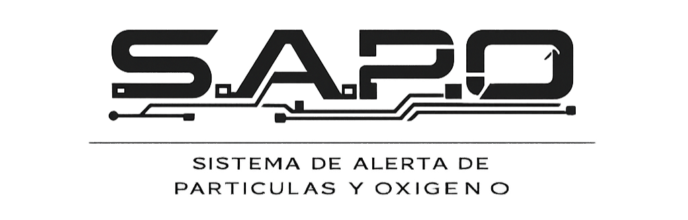

# S.A.P.O
## Sistema de Alerta de Partículas y Oxígeno

Proyecto integrador para la materia de Sistemas Embebidos.

S.A.P.O es un sistema embebido basado en ESP32 diseñado para detectar partículas (humo) y monitorear la calidad del aire en tiempo real, integrando alertas físicas y una interfaz web local con almacenamiento histórico.

---

## Documentación

- [Overview](./Overview/overview.md)
- [SRS – Software Requirements Specification](/docs/architecture/SRS/SRS.pdf)
---

## Equipo

- Gustavo Ugalde Rios
- Gael Olguín Rangel

---

## Estado del Proyecto

Fase: Primer entregable (Overview + SRS inicial)
